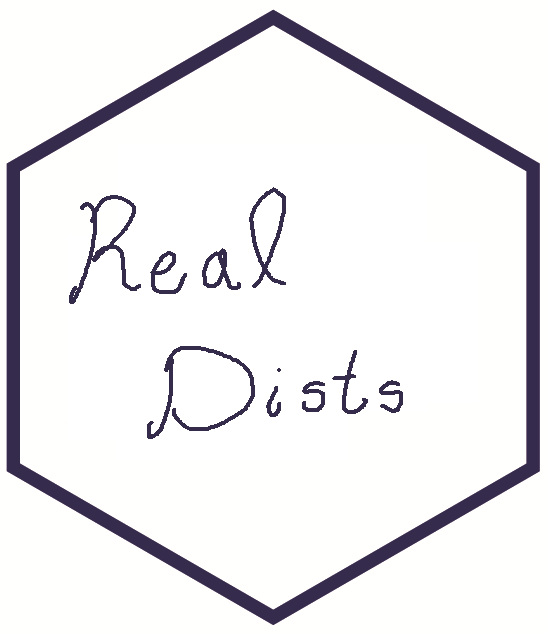

<!-- README.md is generated from README.Rmd. Please edit that file -->

# RealDists 

In this package are available statistical distributions defined in

support. With this package it is possible to estimate parameters and fit
regression models within GAMLSS framework.

## Installation

To install the `RealDists` package you need to install `devtools`
package before, follow the instructions below:

``` r
if (!require('devtools')) install.packages('devtools')
devtools::install_github('fhernanb/RealDists', force=TRUE)
require(RealDists)
```

You can visit the [package
website](https://fhernanb.github.io/RealDists/) to explore the vignettes
(articles) and function reference.
